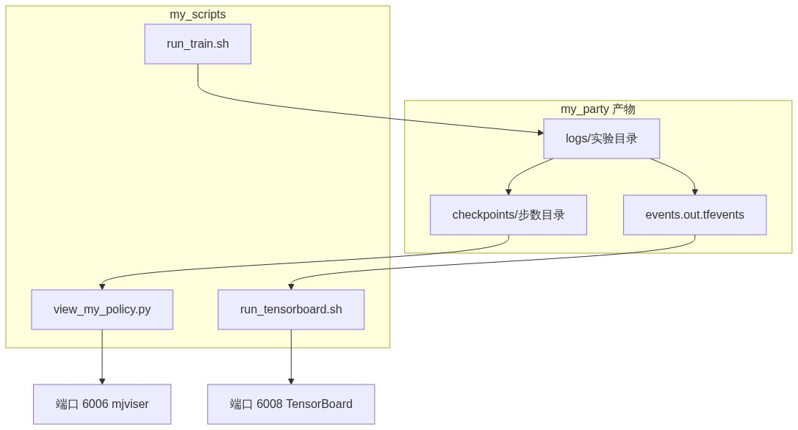
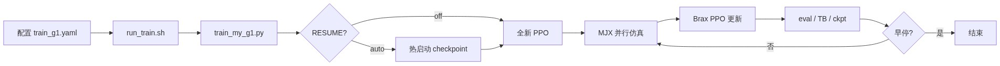
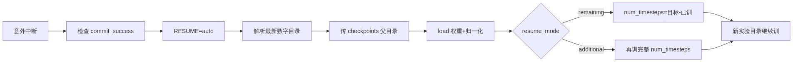

# 宇树 G1 MJX PPO 自有策略训练实操笔记（可复现）

> 工程根目录：`/root/autodl-tmp/mujoco_humanoid`  
> 实测日期：2026-08-21  
> 硬件：AutoDL · RTX 5090 D 32GB  
> 目标：用 MuJoCo Playground 的 `G1JoystickFlatTerrain` + Brax PPO，在本仓库 `my_*` 三目录内完成吞吐调参、长训、断点续训、可视化与 TensorBoard 复盘。  
> 配套环境搭建见仓库 `docs/03_G1_MJX_RL训练环境_手把手教程.md`（方案 B）。本文聚焦**本次新增脚本与实际训练过程**。

---

## 1. 背景与目标

本仓库原先侧重部署与查看（加载现成策略、mjviser 看机器人）。本次工作在同一仓库内建立一套**自有训练闭环**：

1. 用独立 conda 环境 `g1_train` 做 GPU 并行仿真与 PPO；  
2. 用吞吐相关超参把 SPS（steps per second，每秒环境步数）从约万级提到约十万级；  
3. 支持意外中断后的 checkpoint 热启动续训；  
4. 用 mjviser 在自定义端口看策略，用 TensorBoard 看曲线。

验收口径（本笔记范围）：

- 能启动训练并写出带 `commit_success.txt` 的 checkpoint；  
- 能 `RESUME=auto` 热启动；  
- 能在 6006 看策略、在 6008（或 6007）看 TensorBoard。

不在本笔记范围：导出对齐部署用的 `motion.pt`、真机部署、Isaac Lab。

---

## 2. 目录与角色

训练相关新增/使用目录对应关系：

| 目录 | 角色 |
| --- | --- |
| `my_rl_train/` | 训练包 `my_rl/`、默认配置 `configs/train_g1.yaml` |
| `my_scripts/` | 激活、验收、开训、测速、可视化、TensorBoard 入口 |
| `my_party/` | 运行时 cwd；`logs/`、`checkpoints/`、`policies/`、部署 yaml |

<p align="center">
  
</p>
<p align="center"><em>图：训练产物、可视化与 TensorBoard 端口关系。</em></p>

关键环境变量（`my_scripts/env.sh`）：

| 变量 | 典型值 |
| --- | --- |
| `G1_TRAIN_ENV` | `/root/autodl-tmp/conda-envs/g1_train` |
| `TMPDIR` | `/root/autodl-tmp/tmp`（避免写爆系统盘） |
| `MY_PARTY_ROOT` | `$ROOT/my_party` |
| `TF_LOGS` | `/root/tf-logs`（AutoDL 默认 TB） |

---

## 3. 原理简述

### 3.1 仿真与算法栈

- **任务**：`G1JoystickFlatTerrain`（平地摇杆跟指令行走）。  
- **仿真**：MuJoCo MJX（GPU 批量前向）。  
- **算法**：Brax PPO（策略/价值网络 + 观测归一化）。  
- **入口**：Playground 的 `learning.train_jax_ppo`；本仓库用 `train_my_g1.py` 包一层，注入续训与早停。

<p align="center">
  
</p>
<p align="center"><em>图：从配置到 PPO 循环与早停的主流程。</em></p>

### 3.2 SPS 与并行环境

SPS = 单位时间内所有并行环境合计完成的环境步数。提高 `num_envs` 通常能提高 GPU 利用率，但超过某点后收益变小、显存上升。本机冒烟结论写在早期 yaml 注释中：8192 → 约 5k sps；16384 / 65536 约 6k 量级；默认取 **32768**。

约束：`batch_size * num_minibatches % num_envs == 0`。

### 3.3 热启动续训（warm-start）

Orbax checkpoint 目录名是数字步数（如 `000245104640`）。完整保存会有 `commit_success.txt`。  
续训加载的是**网络权重 + RunningStatistics（观测归一化）**，不是严格意义上的“优化器状态原样恢复”，因此叫热启动。

重要坑：`train_jax_ppo` 若收到**目录**路径，会 `glob` 子目录并对 `name` 做 `int()`。因此必须传 `.../checkpoints` **父目录**，不能传具体 step 目录（其下有 `ocdbt.process_0` 等非数字名）。`train_my_g1.py` 已按此修正。

<p align="center">
  
</p>
<p align="center"><em>图：中断后解析 checkpoint 并按 remaining/additional 续训。</em></p>

### 3.4 早停

`EarlyStopper` 挂在 Brax `progress_fn` 上，监控 `eval/episode_reward`：连续 `patience` 次 eval 相对 best 提升不足 `min_delta` 则抛 `EarlyStop` 干净退出。

实测问题：续训剩余步数不大、`num_evals` 较密时，patience=6 会偏早停掉；且 **eval reward 高 ≠ 可视化效果好**。长训建议 `EARLY_STOP=0` 或加大 patience。

### 3.5 JAX 兼容补丁

JAX≥0.10 删除了 `jax.device_put_replicated`，Brax 0.14 仍依赖。`my_rl/jax_compat.py` 在导入训练前用 Mesh/NamedSharding 模拟该 API。

---

## 4. 新增脚本一览

### 4.1 `my_scripts/env.sh`

激活 `g1_train` 之后 `source`。设置 `TMPDIR`、工程根变量，并把 pip 自带的 NVIDIA 动态库路径写入 `LD_LIBRARY_PATH`（避免误用 `/usr/local/cuda` 导致 JAX 掉到 CPU）。

### 4.2 `my_scripts/verify_my_env.sh`

验收 GPU + MJX + `locomotion.load("G1JoystickFlatTerrain")`。开训前建议跑一遍。

### 4.3 `my_scripts/run_train.sh`

后台开训入口：读 yaml、拼 CLI、写 `my_party/logs/train_*.log` 与 `train.pid`。支持环境变量覆盖：`NUM_ENVS`、`BATCH_SIZE`、`RESUME`、`RESUME_MODE`、`TARGET_TIMESTEPS`、`EARLY_STOP`、`USE_TB` 等。

### 4.4 `my_scripts/train_my_g1.py`

核心包装层：

1. `_prepare_resume`：解析 `RESUME`，注入 `--load_checkpoint_path`，按 `remaining` 改写 `num_timesteps`；  
2. `_build_early_stopper` + `_install_ppo_hooks`：包装 `brax...ppo.train` 的 `progress_fn`；  
3. 把最新实验目录软链到 `/root/tf-logs` 方便 AutoDL 6007；  
4. 调用 `learning.train_jax_ppo.run()`。

### 4.5 `my_rl_train/my_rl/resume.py`

`resolve_resume_checkpoint(resume, logs_root, env_name)`：支持 `off` / `auto` / 实验路径 / checkpoints 路径 / 具体 step 路径。`auto` 取匹配 env 前缀的最新实验下最新数字 checkpoint。

### 4.6 `my_rl_train/my_rl/early_stop.py`

`EarlyStopper.on_progress(step, metrics)`；step==0 只播种 best，不消耗 patience。

### 4.7 `my_scripts/smoke_train_speed.sh`

短训测 SPS 与峰值显存。示例：

```bash
NUM_ENVS=16384 BATCH_SIZE=256 NUM_MINIBATCHES=64 NUM_TIMESTEPS=1000000 \
  bash my_scripts/smoke_train_speed.sh
```

### 4.8 `my_scripts/view_my_policy.py`

加载 checkpoint，JIT 后经 mjviser/viser 在指定端口可视化。默认端口曾为 6008；本次常用 **6006**。手动还原 PPO 网络（避免 brax `load_policy` 对 null init 失败）。

### 4.9 `my_scripts/run_tensorboard.sh` 与 `tb_from_train_log.py`

- `run_tensorboard.sh`：默认端口 `TB_PORT=6006`（可改）；`--logdir_spec` 同时挂 `my_party/logs` 与 `/root/tf-logs`。  
- `tb_from_train_log.py`：从 stdout 解析 `step: reward=` 写入 TB（未开 `--use_tb` 时的桥接）。

### 4.10 `my_rl_train/configs/train_g1.yaml`

默认训练与续训、早停开关的单一配置源（见第 5 节）。

---

## 5. 关键参数表

### 5.1 yaml 默认（长训）

| 参数 | 值 | 含义 |
| --- | --- | --- |
| `env_name` | `G1JoystickFlatTerrain` | 任务名 |
| `num_timesteps` | `270000000` | 目标环境步数约 2.7e8 |
| `num_envs` | `32768` | 并行环境数（吞吐关键） |
| `batch_size` | `512` | PPO batch |
| `num_minibatches` | `64` | minibatch 数 |
| `num_evals` | `40` | 全程评估次数 |
| `num_videos` | `0` | 无头机务必 0 |
| `use_tb` | `true` | 写 TensorBoard events |
| `resume` | `off` | 默认全新；命令行可 `RESUME=auto` |
| `resume_mode` | `additional` | 或 `remaining` |
| `target_timesteps` | `270000000` | remaining 模式总目标 |
| `early_stop.enabled` | `true` | 可用 `EARLY_STOP=0` 关掉 |
| `early_stop.patience` | `6` | 连续无提升次数 |
| `early_stop.min_delta` | `0.05` | 最小提升幅度 |
| `early_stop.min_evals` | `4` | 最少训练后 eval 数才允许停 |
| `early_stop.metric_key` | `eval/episode_reward` | 监控指标 |

### 5.2 PPO 运行时打印的其它超参（Playground 默认，本次未改）

| 参数 | 典型值 |
| --- | --- |
| `learning_rate` | `0.0003` |
| `discounting` | `0.97` |
| `entropy_cost` | `0.005` |
| `clipping_epsilon` | `0.2` |
| `unroll_length` | `20` |
| `num_updates_per_batch` | `4` |
| `episode_length` | `1000` |
| 网络隐层 | `512-256-128`，激活 silu |
| `policy_obs_key` | `state` |
| `value_obs_key` | `privileged_state` |

### 5.3 吞吐调参前后对比（本机实测）

| 阶段 | num_envs | batch | minibatches | 粗估 SPS |
| --- | --- | --- | --- | --- |
| 早期慢训 | 8192 | 256 | 32 | ~1.3e4 |
| 调参后长训 | 32768 | 512 | 64 | ~7e4–1.1e5 |

学习率等优化超参未改；速度变化主要来自并行规模。

---

## 6. 手把手复现步骤

以下假设已按 `docs/03_*.md` 装好 `g1_train`，且本仓库在 `/root/autodl-tmp/mujoco_humanoid`。

### 6.1 激活与验收

```bash
cd /root/autodl-tmp/mujoco_humanoid
source /root/miniconda3/etc/profile.d/conda.sh
conda activate /root/autodl-tmp/conda-envs/g1_train
source my_scripts/env.sh
bash my_scripts/verify_my_env.sh
```

期望：GPU 可用、G1 环境可 load。

### 6.2（可选）冒烟测速

```bash
NUM_ENVS=16384 BATCH_SIZE=256 NUM_MINIBATCHES=64 \
  NUM_TIMESTEPS=1000000 NUM_EVALS=2 \
  bash my_scripts/smoke_train_speed.sh
```

看日志末尾 `sps=` 与 `peak_vram_MiB=`。再试 `NUM_ENVS=65536 BATCH_SIZE=512 NUM_MINIBATCHES=128` 对比。本机结论是再堆 envs 收益有限，默认用 32768。

### 6.3 全新长训

```bash
# yaml 默认 early_stop=on、use_tb=on、2.7e8 步
bash my_scripts/run_train.sh

# 推荐长训关掉早停，避免过早 plateau 退出
EARLY_STOP=0 bash my_scripts/run_train.sh
```

监控：

```bash
tail -f my_party/logs/train_*.log
cat my_party/logs/train.pid
nvidia-smi
```

停止：

```bash
kill $(cat my_party/logs/train.pid)
```

产物：

- 实验目录：`my_party/logs/G1JoystickFlatTerrain-<时间戳>/`  
- checkpoint：`.../checkpoints/0000.../`（完整则有 `commit_success.txt`、`ppo_network_config.json`）  
- TB：`.../events.out.tfevents.*`（`--use_tb` 时写在实验目录根下）

### 6.4 断点续训

先确认最新 ckpt 完整：

```bash
ls my_party/logs/G1JoystickFlatTerrain-*/checkpoints/*/commit_success.txt | tail
```

热启动后再训配置里的一整段 `num_timesteps`：

```bash
RESUME=auto EARLY_STOP=0 bash my_scripts/run_train.sh
```

只补到总目标（例如已训到 245104640，目标 270000000）：

```bash
RESUME=auto RESUME_MODE=remaining TARGET_TIMESTEPS=270000000 \
  EARLY_STOP=0 bash my_scripts/run_train.sh
```

日志应出现类似：

```text
[resume] warm-start from .../000245104640 (step=245104640)
[resume] load_checkpoint_path=.../checkpoints
Restoring from: .../000245104640
```

若报 `invalid literal for int() ... 'ocdbt.process_0'`，说明传了 step 子目录；应使用已修复的 `train_my_g1.py`（传父目录）。

注意：可视化占显存约二十多 GiB 时不要同时开训，先停 viewer。

### 6.5 策略可视化（示例端口 6006）

```bash
source /root/miniconda3/etc/profile.d/conda.sh
conda activate /root/autodl-tmp/conda-envs/g1_train
source my_scripts/env.sh

# 指定最优 step（示例）
python my_scripts/view_my_policy.py --port 6006 \
  --ckpt my_party/logs/G1JoystickFlatTerrain-20260821-225128/checkpoints/000006553600

# 或某实验下最新
python my_scripts/view_my_policy.py --port 6006 \
  --ckpt-root my_party/logs/G1JoystickFlatTerrain-20260821-145625/checkpoints
```

首次 JIT 约 1–2 分钟。AutoDL 打开自定义服务对应端口。

### 6.6 TensorBoard（示例端口 6008）

```bash
# 软链实验目录到 AutoDL 默认路径（可选）
ln -sfn /root/autodl-tmp/mujoco_humanoid/my_party/logs/G1JoystickFlatTerrain-20260821-225128 \
  /root/tf-logs/G1JoystickFlatTerrain-20260821-225128

TB_PORT=6008 bash my_scripts/run_tensorboard.sh
# 或：
tensorboard --host 0.0.0.0 --port 6008 \
  --logdir_spec "party:/root/autodl-tmp/mujoco_humanoid/my_party/logs,tf:/root/tf-logs"
```

记录位置小结：

| 路径 | 内容 |
| --- | --- |
| `my_party/logs/<exp>/events.out.tfevents.*` | `--use_tb` 原生曲线 |
| `my_party/logs/<exp>/tb/` | `tb_from_train_log.py` 桥接 |
| `/root/tf-logs/` | 软链；AutoDL 6007 常读这里 |

---

## 7. 本次训练过程实录（2026-08-21）

### 7.1 时间线

| 时间（约） | 实验 / 动作 | 配置要点 | 结果 |
| --- | --- | --- | --- |
| 13:42 | `...-134220` | envs=8192, batch=256, mb=32, 2e6 步 | 慢；reward 约 -5 附近 |
| 14:13–14:24 | 冒烟 16384 / 65536 | 测 SPS / 显存 | 确定默认 32768 |
| 14:40 | `...-144008` | 32768 / 512 / 64，3e7 步 | 吞吐明显上升；reward 仍负 |
| 14:56 | `...-145625` | 32768，目标 2.7e8 | 训到约 2.45e8，reward 最高约 15.4 后意外中断；ckpt 完整 |
| 22:51 | `...-225128` 续训 | 热启动 245104640，remaining≈2.49e7，早停开 | peak 17.04@6553600 后连续 6 次无提升，约 1.05e7 步早停 |
| 之后 | 6006 可视化 / 6008 TB | 最优 ckpt `000006553600` | 观感仍一般；说明 reward≠效果 |

### 7.2 长训 `145625` 关键 eval（节选）

从约 -5.9 升到约 15：

| step | reward |
| --- | --- |
| 0 | -5.942 |
| 86507520 | 0.719 |
| 144179200 | 8.480 |
| 201850880 | 14.580 |
| 230686720 | 15.412 |
| 245104640 | 14.994（中断前最后一次） |

### 7.3 续训早停曲线要点

- 热启动后 step0 eval ≈ 14.76；  
- best = 17.0424 @ 6553600；  
- 随后 6 次 eval 在 15.5–16.5，触发 plateau 早停；  
- **未跑满** remaining 的 2.49e7 步。

结论：早停逻辑按配置工作，但对续训阶段过激；且指标不能代表行走观感。复现长训请默认 `EARLY_STOP=0`。

---

## 8. 常见问题与处理

| 现象 | 原因 / 处理 |
| --- | --- |
| JAX 落到 CPU | 勿把错误 CUDA 路径塞进 `LD_LIBRARY_PATH`；用 `env.sh` |
| 系统盘写满 | `TMPDIR` 指到数据盘 |
| 续训 `ocdbt.process_0` int 报错 | 传 `checkpoints/` 父目录 |
| 训练 OOM | 先停 `view_my_policy`；或降低 `num_envs` |
| 无头机 OpenGL 崩 | `--num_videos 0` |
| reward 高但走得差 | 看视频/viser，勿只信早停；关掉早停继续训或调奖励 |
| TB 6007 看不到新实验 | 软链到 `/root/tf-logs` 或开 6008 指向 `my_party/logs` |

---

## 9. 最小命令速查

```bash
cd /root/autodl-tmp/mujoco_humanoid
source /root/miniconda3/etc/profile.d/conda.sh
conda activate /root/autodl-tmp/conda-envs/g1_train
source my_scripts/env.sh

# 验收
bash my_scripts/verify_my_env.sh

# 全新长训（关早停）
EARLY_STOP=0 bash my_scripts/run_train.sh

# 续训到 2.7e8
RESUME=auto RESUME_MODE=remaining TARGET_TIMESTEPS=270000000 \
  EARLY_STOP=0 bash my_scripts/run_train.sh

# 看策略
python my_scripts/view_my_policy.py --port 6006 \
  --ckpt-root my_party/logs/<exp>/checkpoints

# 看曲线
TB_PORT=6008 bash my_scripts/run_tensorboard.sh
```

---

## 10. 相关文件索引

| 路径 | 说明 |
| --- | --- |
| `my_rl_train/configs/train_g1.yaml` | 默认超参 |
| `my_rl_train/my_rl/resume.py` | 续训解析 |
| `my_rl_train/my_rl/early_stop.py` | 早停 |
| `my_rl_train/my_rl/jax_compat.py` | JAX 兼容 |
| `my_scripts/run_train.sh` | 开训 |
| `my_scripts/train_my_g1.py` | 训练入口包装 |
| `my_scripts/view_my_policy.py` | 可视化 |
| `my_scripts/run_tensorboard.sh` | TB |
| `my_scripts/smoke_train_speed.sh` | 测速 |
| `docs/03_G1_MJX_RL训练环境_手把手教程.md` | 环境安装 |
| `docs/docx/` | 本笔记 Markdown / DOCX / 流程图资源 |

按第 6 节顺序执行，即可在同机复现整条训练与查看链路；第 7 节数字用于对照本机已跑结果，换机器时以本地 SPS 与显存为准重新冒烟即可。
